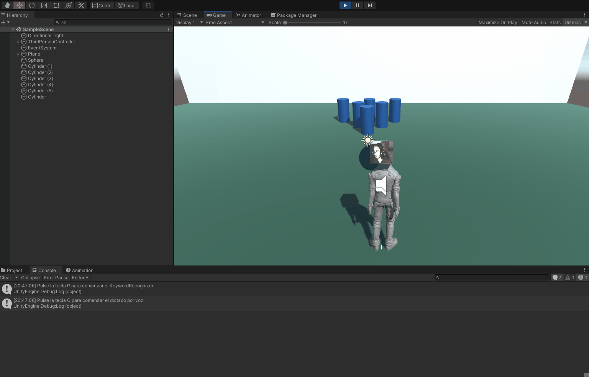

# II_practica4 - Cámara y Micrófono
## Fabio Bianchini Cano
------
## Introducción

La práctica que hemos realizado implementa las funciones de cámara y micrófono, más tratamiento de audio, en una escena de Unity.

-------
## Cámara
Para la implementación de la cámara, en nuestro script _Camara.cs_, hemos creado en la función Start, la creación del controlador de la cámara y el inicio de su ejecución. 

Este script está asociado al cubo que tiene el personaje en la cabeza, el cual, mediante un cambio de texturas, podemos ajustarle el valor del vídeo recogido por la cámara, dando la sensación que somos nosotros los que estamos en la cabeza del jugador.

```
private WebCamTexture webcam;

void Start() {
  if (webcam == null) 
    webcam = new WebCamTexture();

  GetComponent<Renderer>().material.mainTexture = webcam;

  if (!webcam.isPlaying)
    webcam.Play();
}
```
---

## Micrófono
Y, a su vez, para el micrófono, en el script _MyMicrophone.cs_ hemos instanciado la creación del objeto tipo _AudioSource_, el cual reproduce la entrada de audio del micrófono por defecto durante 50 segundos.

Este script está asociado a un objeto de tipo audio dentro de la escena, el cual está ligado al jugador, por lo tanto lo sigue físicamente por toda la escena, haciendo que el sonido siempre se escuche con la misma intensidad.

```
void Start() {
  AudioSource audioSource = GetComponent<AudioSource>();
  audioSource.clip = Microphone.Start("", true, 50, 44100);
  audioSource.Play();
}
```

---
## Keyboard Recognizer
Utilizando la librería *KeyboardRecognizer* hemos conseguido implementar un pequeño apartado donde, pulsando la tecla **P**, la aplicación escuchará por el micrófono lo que digamos, y lo procesará. Si detecta alguna palabra de la lista que nosotros mismos hemos elegido, actuará en consecuencia ejecutando la función *OnPhraseRecognized*. Un evento que se activa cuando detecta una palabra de la lista. 

``` c#
private KeywordRecognizer m_Recognizer;

void Start () {
  Debug.Log("Pulse la tecla P para comenzar el KeywordRecognizer.");
  m_Recognizer = new KeywordRecognizer(m_Keywords);
  m_Recognizer.OnPhraseRecognized += OnPhraseRecognized;
}

private void OnPhraseRecognized(PhraseRecognizedEventArgs args) {
  StringBuilder builder = new StringBuilder();
  builder.AppendFormat("{0} ({1}){2}", args.text, args.confidence, Environment.NewLine);
  builder.AppendFormat("\tTimestamp: {0}{1}", args.phraseStartTime, Environment.NewLine);
  builder.AppendFormat("\tDuration: {0} seconds{1}", args.phraseDuration.TotalSeconds, Environment.NewLine);
  Debug.Log(builder.ToString());
  fusRoDah_.FusRoDah();   
  finished_  = true;
}
```

  

---
## Dictation Recognizer
Y con la librería *DictationRecognizer* implementamos la parte del programa que se dedica a, cuando pulsamos la tecla **O** para empezar con la ejecución, escuchar por el micrófono e intepretar las palabras que oye mientras las escribe por consola.

``` c#
void StartDictation() {
  m_DictationRecognizer = new DictationRecognizer();
  m_DictationRecognizer.DictationResult += (text, confidence) => {
      Debug.LogFormat("Dictation result: {0}", text);
      //m_Recognitions.text += text + "\n";
  };

  m_DictationRecognizer.DictationHypothesis += (text) => {
      Debug.LogFormat("Dictation hypothesis: {0}", text);
      //m_Hypotheses.text += text;
  };

  m_DictationRecognizer.DictationComplete += (completionCause) => {
      if (completionCause != DictationCompletionCause.Complete)
          Debug.LogErrorFormat("Dictation completed unsuccessfully: {0}.", completionCause);
  };

  m_DictationRecognizer.DictationError += (error, hresult) => {
      Debug.LogErrorFormat("Dictation error: {0}; HResult = {1}.", error, hresult);
  };

  m_DictationRecognizer.Start();    
}
```